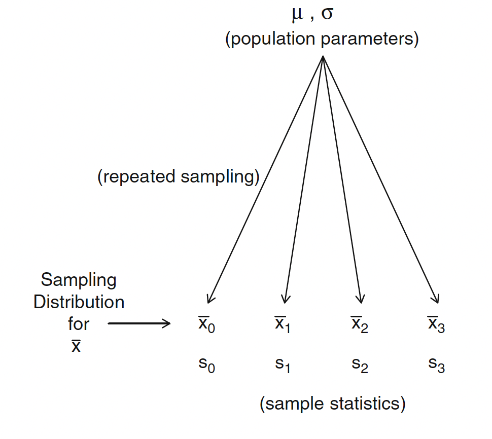

```{r setup, include=FALSE}
knitr::opts_chunk$set(echo = FALSE, fig.align = "center")

library(tidyverse)
library(latex2exp)

theme_set(
  theme_light(base_family = "Amiri") + 
  theme(plot.title = element_text(size = 16))
)


template <- function(min = -4, max = 4, close_up = FALSE) {
  
  out <- data.frame(x = c(min, max)) |> 
  ggplot2::ggplot(aes(x)) +
  ggplot2::geom_hline(yintercept = 0, color = "grey50") +
  ggplot2::labs(y = "f(x)", x = "x") +
  ggplot2::scale_x_continuous(
    labels = seq(min, max, 1), 
    breaks = seq(min, max, 1)
  )
  
  if (!close_up) {
    out + ggplot2::geom_vline(xintercept = 0, color = "grey50") 
  } else {
    out
  }
}

geom_function_shade <- function(lower, upper, f = dnorm, .fill = "grey50") {
  ggplot2::stat_function(
      geom = "area",
      fun = f,
      fill = .fill,
      xlim = c(lower, upper)
  ) 
}

```

```{css, echo=FALSE}
body {
  font-family: Amiri, serif
}
```

*The purpose of this notebook is to build some intuition behind normal distributions on how to work with them in the context of the Null Hypothesis Significance Testing framework (NHST). Skip to the last section if you only want some intuition behind the math in the formula for the normal distribution*

<font size="2">

***Keywords**:* normal distribution; standard normal distribution; sampling distribution; standard error; NHST; p-values

</font>

<h2>

</h2>

Before getting started, let's think about the arbitrary distribution shown in the graph below. Think of this as a *probability function.*

```{r, out.width = "90%"}
p <- runif(5)
p <- p / sum(p)
p <- round(p, 2)
p <- p / sum(p)
names(p) <- seq_along(p)

enframe(p, name = "x", value = "p") |> 
  ggplot(aes(x, p)) + 
  geom_text(aes(y = p + 0.01, label = scales::comma(p, accuracy = 0.01)), 
            family = "Amiri", size = 5) + 
  geom_col(width = 1/2, fill = "steelblue") +
  labs(y = "f(x)")
```

This function takes **integers** as inputs and spits out probabilities. Any input other than $\{1, 2, 3, 4, 5\}$ gets assigned a probability of zero. Notice that if you add up the probabilities assigned to all of these numbers you end up with $1$. This is just how probability works.

1.  The number assigned to any number (or "event") has to be a number between one and zero (*aka a probability*).
2.  The sum of all probabilities must equal to one.

*These are the rules!*

## The normal distribution

The normal distribution is also a function, except that it takes **real numbers** in the $(-\infty, \infty)$ range.

This function describes a **continuous distribution***,* unlike the *discrete distribution* shown in the previous graph. This change from discrete to continuous brings important consequences creates a major change: *continuous distributions don't spit out probabilities. Interpreting the y-axis gets tricky in the world of "real numbers".*

<aside>

The output $f(x)$ is known as a *probability density.* More on that below.

</aside>

For example, in a distribution of this kind, what do you think is the probability that $x = 23.24957$? How about the probability that $x = 23.00001$? *In both cases, the answer is zero.* There are infinitely many numbers between $23$ and $24$, so you can imagine that the probability that $x$ takes the value of $23.34532$ is exactly zero.

<aside>

It's important to keep this in mind because $p$-values are statements of probability.

</aside>

The normal distribution has two parameters: (1) the **mean,** or $\mu$, which tells us where the *center* of the distribution is located; and (2) the **standard deviation,** or $\sigma$, which tells us something about the *shape* of the distributions

Here's a graph for the normal distribution when $\mu = 0$ and $\sigma = 1$. This is also known as the **standard normal distribution***.*

```{r, out.width = "90%"}
template(-5, 5) + 
  geom_function(fun = dnorm, n = 1e3) + 
  labs(title = TeX(r'(The normal distribution with $\mu = 0$ and $\sigma = 1$)'), 
       subtitle = TeX(r'(AKA the $\textit{standard normal distribution}$)'),
       caption = TeX(r"(AKA that $\textit{thing}$ that shows up in the table of z-scores)"))
```

This graph is similar to the previous graph, except that the values in the y-axis are now called *probability densities.* And because the normal distribution is defined for *all real numbers---*i.e., $x \in (-\infty, +\infty)$---, the densities never go all the way down to zero. Looking at the graph, it may look like $f(5) = 0$, but that's not true, $f(5)$ is just *very very close* to zero.

This time, the rules are a little different.

1.  The probability---*not the probability density*---assigned to any $x$ is *always* equal to zero,

    However, the probability assigned to any **interval** *is* a well defined. For example, the probability that $2 \leq x \leq 3$ is always going to be a number between 0 and 1.

2.  *The area under the curve must be equal to one.* This is the same as what we said earlier about how the sum of all probabilities must equal to one.

*These are the rules!*

Note that in some cases the densities can be larger than 1. This is OK. Remember: probability densities are not probabilities.

For example:

```{r, out.width = "90%"}
template(0, 10) + 
  geom_function(fun = \(x) dnorm(x, mean = 5, sd = 1/4), n = 1e3) +
  geom_hline(yintercept = 1, linetype = "dashed") +
  labs(title = TeX(r'(The normal distribution with $\mu = 5$ and $\sigma = 0.25$)'))
```

Every normal distribution exhibits the following behavior:

-   The probability that $x$ is within one standard deviation ($\sigma$) away from the mean is roughly 68%.

-   The probability that $x$ is within two standard deviations ($2\sigma$) away from the mean is roughly 95%.

-   The probability that $x$ is above the mean ($x \geq \mu$) is 50%.

-   The probability that $x$ is below the mean ($x \leq \mu$) is also 50%.

```{r, layout="l-page", fig.height=4, fig.width=10}
p1 <- template(-5, 5) +
  geom_function(fun = dnorm) + 
  geom_function_shade(-1, 1) + 
  geom_vline(xintercept = c(-1, 1), linetype = "dashed") +
  annotate("text", x = 0, y = 0.2, label = "68.27%") 

p2 <- template(-5, 5) +
  geom_function(fun = dnorm) + 
  geom_function_shade(-2, 2) + 
  geom_vline(xintercept = c(-2, 2), linetype = "dashed") +
  annotate("text", x = 0, y = 0.2, label = "95.45%") 

p3 <- template(-5, 5) +
  geom_function(fun = dnorm) + 
  geom_function_shade(0, 5) + 
  geom_vline(xintercept = 0, linetype = "dashed") +
  annotate("text", x = 1/2, y = 0.2, label = "50%") 

p4 <- template(-5, 5) +
  geom_function(fun = dnorm) + 
  geom_function_shade(-5, 0) + 
  geom_vline(xintercept = 0, linetype = "dashed") +
  annotate("text", x = -1/2, y = 0.2, label = "50%") 

library(patchwork)

(p1 + p2) / (p3 + p4)

```

## The sampling distribution

***Why should we care about all of this?***

Believe it or not, normal distributions show up in the real world all the time. But this isn't the reason most scientists care about normal distributions. Most of the data sociologists work with doesn't behave like this at all!

Rather, *we care about the normal distribution because it plays a key role in **statisticalinference**, particularly when we want to use **samples** to make statements about **populations**.*

The **sampling distribution** is the set of possible sample "statistics" (e.g., averages) that could have been observed, *if the data collection process had been repeated many many times.* There's an important theorem in statistics called the Central Limit Theorem ([CLT](https://youtu.be/JNm3M9cqWyc)) that proves that this sampling distribution converges to a normal distribution when the sample size is big enough, *regardless of how our data looks like.*

<aside>

The main assumption behind the CLT is that the sample size is *big enough*. If we wanted to work with smaller sample sizes we might consider using Student's $t$-distribution instead.

</aside>

The intuition behind this re-sampling thought experiment is captured in the following figure:

```{r, out.width="70%"}

```

<aside>

This figure taken from @lynch2013 [pp. 84].

</aside>

What is incredible about the CLT is that *the z-score of the sample mean* behaves exactly like the standard normal distribution *regardless* of the distribution of the original variable. In other words, if we were to repeat the sampling procedure many many times, each time calculating the average, we would end up collecting a list of values patterned like a normal distribution.

The following graphs shows a sampling distribution (right panel) that I constructed by taking 100,000 samples of size 40 from the original population (left panel).

```{r, layout="l-page", fig.height=3, fig.width=10, cache=TRUE}
library(patchwork)

fake_data <- round(rbeta(1e5, 1, 3) * 100)

p1 <- data.frame(x = fake_data) |> 
  ggplot(aes(x)) + 
  geom_histogram(bins = 20, color = "white") + 
  geom_vline(xintercept = mean(fake_data), color = "red") + 
  annotate("text", x = 50, y = 1e4, 
           label = paste("Population Mean: ", mean(fake_data))
  ) +
  labs(title = "Original Data", y = "Frequency")

library(future.apply)
future::plan(multisession, workers = parallel::detectCores() - 1L) 

sim <- future_replicate(
  n = 1e5, 
  expr = sample(fake_data, 40), 
  simplify = FALSE, 
  future.seed = NULL
)

names(sim) <- seq_along(sim)

df <- enframe(sim, name = "s", value = "x") |> 
  unnest(x)

df <- df |> 
  mutate(s = as.integer(s)) |> 
  group_by(s) |> 
  summarize(avg = mean(x), sd = sd(x), n = n()) |> 
  mutate(se = sd / sqrt(n))

p2 <- df |> 
  ggplot(aes(avg)) + 
  geom_histogram(color = "white") +
  geom_vline(xintercept = mean(fake_data), color = "red") + 
  labs(title = "Sampling Distribution", y = "Frequency")


p1 + p2
```

Note that in the real world we don't have access to the whole population. We also don't have access to the sampling distribution (i.e., we don't have enough money to sample the population more than once). However, *we can estimate the standard deviation of the sampling distribution which we call the* **standard error.**

## Null hypothesis testing

Because we don't know the mean of the population ($\mu$), we usually compare our sample average to a different value which we'll call the *null hypothesis* ($H_0$).

The hypothesis testing framework consists on the following five steps:

1.  We assume a hypothesis we would like to refute: a *null hypothesis* often denoted as $H_0$.

2.  We choose a *test statistic* (e.g., an average), which is some function of the observed data.

3.  We derive the *sampling distribution* of the test statistic, given the null hypothesis. This distribution is also called the *reference distribution*.

    For example, this can be the normal distribution. If our sample size is small it's Student's $t$-distribution.

4.  We ask whether the observed value of the test statistic is likely to occur under the reference distribution. This probability is also known as a $p$*-value*.

    The $p$-value is the probability that, under the null hypothesis, we observe a value of the test statistic at least as extreme as the one we actually observed.

5.  We reject the null hypothesis if the $p$-value is less than or equal to the confidence level $\alpha$. Otherwise, we retain the null hypothesis (i.e., we *fail to reject* the null hypothesis).

    The level of confidence represents the probability of false rejection if the null hypothesis is true, which is also called a *type I error* (or *false positive*). Researchers can specify the degree of type I error, but it is not possible to directly control *type II error* (or *false negative*).

    There is a trade-off between both types of error: minimizing the false positive rate usually increases the false negative rate.

## Intuition behind the math

$$
f(x) = \frac{1}{\sigma \sqrt{2 \pi}} \exp\bigg( - \frac{(x - \mu)^2 }{2\sigma^2} \bigg)
$$

Let's try and not get scared with the math behind the equation for the normal distribution.

We'll start with a simpler expression, a parabola centered around $\phi$.

$$
f(x) = (x - \phi)^2
$$

```{r, out.width = "90%"}
template(-1, 7) +
  geom_function(fun = \(x) (x - 3)^2) 
```

<aside>

<br>

This is how it looks when $\phi = 3$

</aside>

But the normal distribution is more like an *upside-down parabola.* We get something like this by *multiplying by negative one*. Let's make $\phi = 0$ as well.

$$
f(x) = -x^2  
$$

```{r, out.width = "90%"}
template() +
  geom_function(fun = \(x) -x^2)
```

This is looking closer, except that *probability densities can't be negative.* To ensure the $f(x)$ is never negative we use **exponents**.

$$
f(x) = e^{-x^2}
$$

```{r, out.width = "90%"}
template() +
  geom_function(fun = \(x) exp(-(x)^2))
```

Note that this is *almost* a normal distribution! The only reason it's not is because the area under the curve is larger than 1, and probabilities must *always* be between 0 and 1.

<aside>

Using [integral calculus](https://www.integral-calculator.com/#expr=e%5E-x%5E2&lbound=minf&ubound=inf), we can tell that this area adds up to approximately 1.78.

</aside>

So that's why we have to add a lot of *junk*. Otherwise this thing wouldn't behave according to the rules of probability.

$$
f(x) = \frac{1}{\sqrt{2\pi}} \exp \bigg( -\frac{1}{2}(x - \mu)^2 \bigg)
$$

This gives us

```{r, out.width = "90%"}
template() +
  geom_function(fun = \(x) (1/sqrt(pi)) * exp(-(x)^2)) +
  labs(title = "Standard normal distribution", 
       subtitle = TeX(r'($\mu = 0$ and $\sigma = 1$)'))

```

But we're not there yet. We are still missing the parameter that tells us how dispersed (or concentrated) the distribution is. That is, we haven't included the standard deviation $\sigma$.

If we want to add *that*, we need to add it in two places.

$$
f(x) = \frac{1}{\sqrt{2 \pi \sigma^2}} \exp\bigg(- \frac{(x - \mu)^2}{2 \sigma^2}\bigg)
$$

```{r, out.width = "90%"}
template(-5, 15) +
  geom_function(fun = \(x) dnorm(x, 5, 3)) + 
  labs(title = TeX(r"(Normal Distribution with $\mu = 5$ and $\sigma = 3$)"))
```
